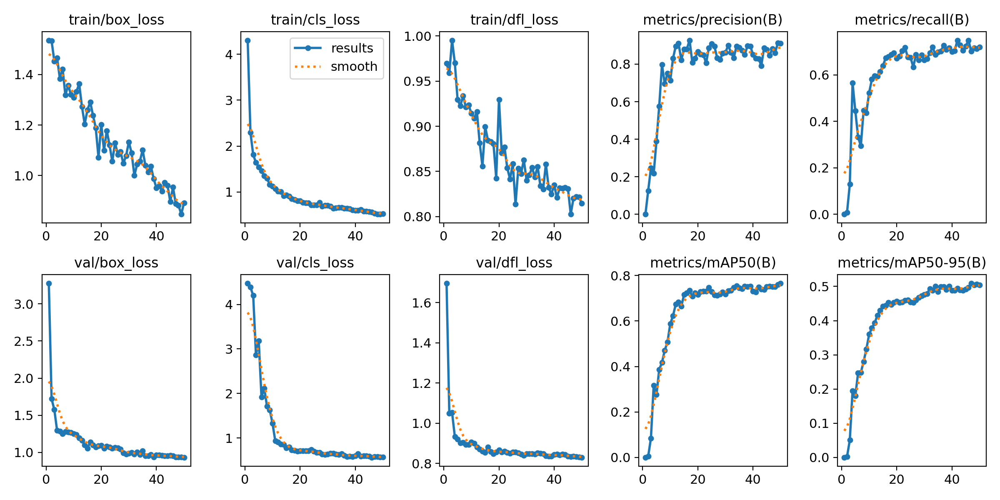
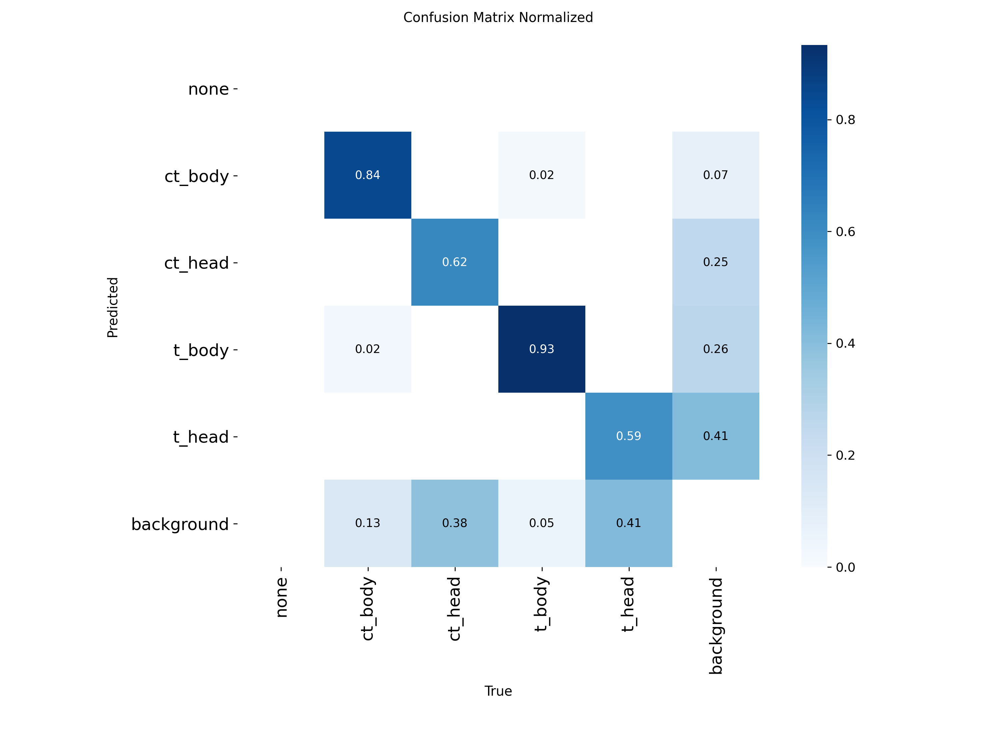
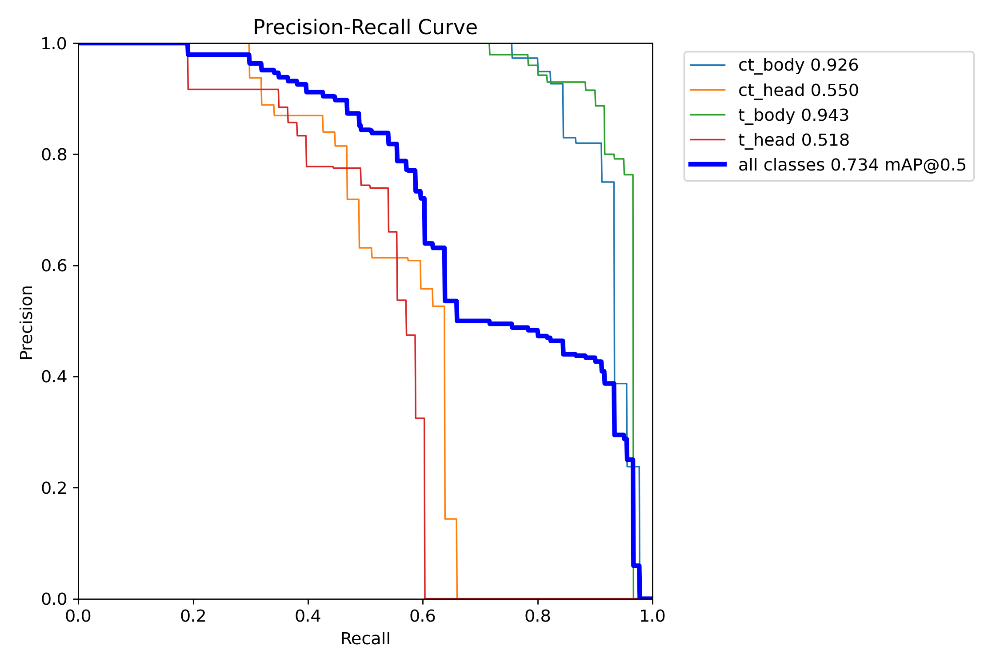
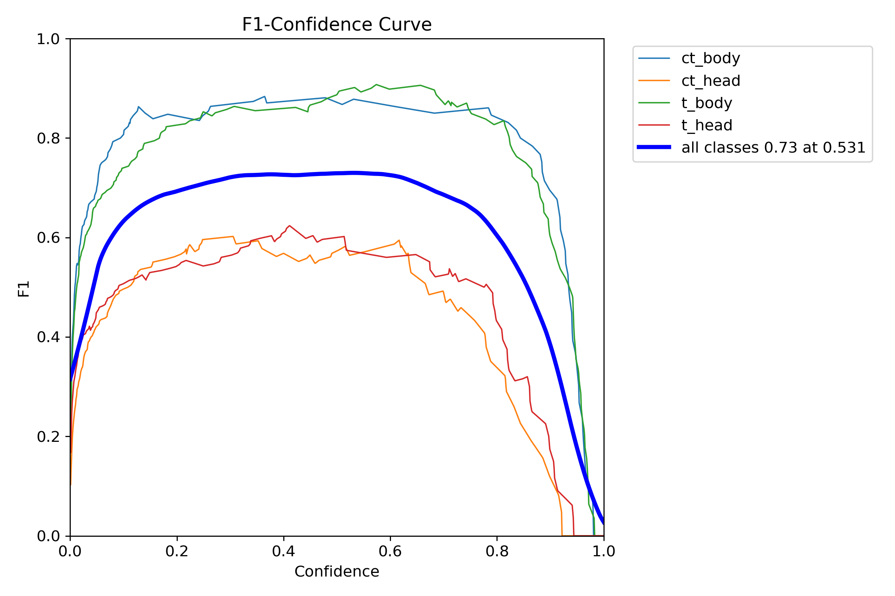
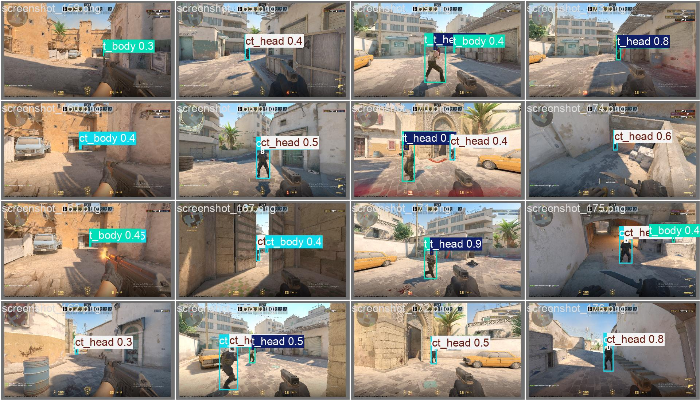
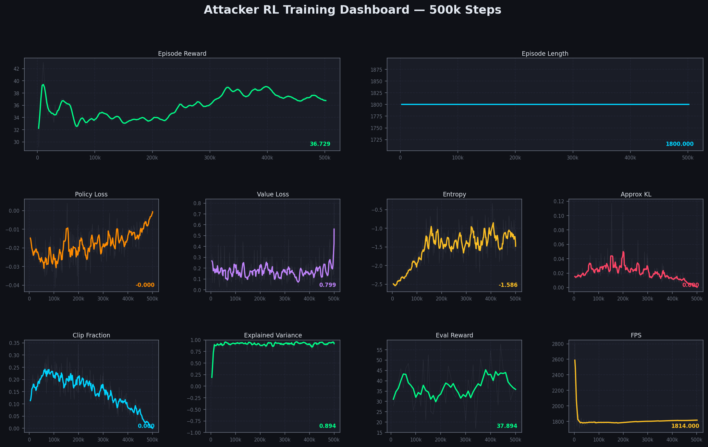

# CS2 Attacker RL Coaching System

Records your CS2 gameplay, trains a reinforcement learning agent on it, and gives you real-time action recommendations while you play.

---

## How it works

```
CS2 game state  ──►  gsi_recorder.py  ──►  source/gsi/<match>.jsonl
Your screen     ──►  capture.py       ──►  source/yolo/<match>.jsonl
                              │
                              ▼
                        prepare.py  ──►  data/attacker_buffer.h5
                              │
                              ▼
                    rl.train (PPO)  ──►  rl/models/attacker_ppo_final.zip
                              │
                              ▼
                       inference.py  ──►  live HUD overlay
```

---

## Project structure

```
pt/
├── run.py                    ← start here: launches recording
├── prepare.py                ← build training dataset from recordings
├── inference.py              ← live model HUD while playing
├── plot_training.py          ← generate training plots
│
├── YOLO Model.ipynb          ← YOLO training notebook (Google Colab)
├── cs2_yolo_model/           ← trained YOLO weights + training results
│   ├── weights/
│   │   ├── best.pt           ← best checkpoint
│   │   └── last.pt
│   ├── results.png           ← loss + metric curves
│   ├── confusion_matrix_normalized.png
│   ├── BoxPR_curve.png
│   ├── BoxF1_curve.png
│   └── ...
│
├── recording/
│   ├── capture.py            ← screen capture + YOLO inference
│   ├── gsi_recorder.py       ← CS2 GSI tick recorder
│   └── gsi_server.py         ← full GSI REST API (optional)
│
├── rl/
│   ├── pipeline.py           ← GSI + YOLO → RL frame format
│   ├── observation.py        ← 62-dim state encoder
│   ├── actions.py            ← 16-action space + attacker mask
│   ├── reward.py             ← reward function
│   ├── action_inference.py   ← labels frames with action IDs
│   ├── replay_buffer.py      ← offline experience store
│   ├── env.py                ← Gymnasium environment
│   ├── policy.py             ← MLP network
│   └── train.py              ← PPO training loop
│
├── source/                   ← raw recordings (auto-created by run.py)
│   ├── gsi/
│   └── yolo/
│
└── data/                     ← processed buffers
```

---

## YOLO Model

The YOLO model detects players on screen and classifies them by team and body part.

**Dataset:** [Counter-Strike 2 Body and Head Classification](https://www.kaggle.com/datasets/merfarukgnaydn/counter-strike-2-body-and-head-classification)

**Classes:** `none` · `ct_body` · `ct_head` · `t_body` · `t_head`

**Training setup:**
- Model: YOLOv8n (nano)
- Epochs: 50 · Batch: 16 · Image size: 640
- Optimizer: AdamW · LR: 0.001
- Trained on Google Colab (Tesla T4 GPU)

**Results after 50 epochs:**

| Metric | Value |
|---|---|
| mAP@50 | 76.6% |
| mAP@50-95 | 50.4% |
| Precision | 91.2% |
| Recall | 72.0% |

**Training curves:**



**Confusion matrix (normalized):**



**Precision-Recall curve:**



**F1 curve:**



**Validation predictions:**



To retrain, open `YOLO Model.ipynb` in Google Colab and run both cells.
Weights are saved to `cs2_yolo_model/weights/best.pt`.

---

## RL Model

The RL agent is a MaskablePPO (sb3-contrib) trained on recorded gameplay.

**Observation:** 62-dim float vector — player state, up to 5 enemies, bomb, utility, time

**Actions:** 14 attacker actions (ENGAGE_ENEMY, RUSH_SITE, PLANT_BOMB, PEEK_CORNER, etc.)

**Training results (500k steps on dummy data):**



| Metric | Value |
|---|---|
| Final reward | 36.7 |
| Explained variance | 0.894 |
| Eval mean reward | 37.9 |

---

## Quick start

### 1. Install dependencies

```bash
pip install fastapi uvicorn mss ultralytics opencv-python-headless \
            requests numpy gymnasium stable-baselines3 sb3-contrib \
            torch h5py tensorboard
```

### 2. CS2 GSI config

Create `gamestate_integration_gsi.cfg` in your CS2 `cfg/` folder:

```
"CS2 GSI"
{
    "uri"       "http://127.0.0.1:3000/"
    "timeout"   "5.0"
    "heartbeat" "10.0"
    "data"
    {
        "provider" "1"  "map" "1"  "map_round_wins" "1"
        "player_id" "1"  "player_state" "1"  "player_weapons" "1"
        "player_match_stats" "1"  "round" "1"  "bomb" "1"
        "phase_ends_in" "1"
    }
}
```

Add `-gamestateintegration` to CS2 Steam launch options.

### 3. Record gameplay

```bash
python run.py --model cs2_yolo_model/weights/best.pt
```

Play CS2. Files are saved automatically to `source/gsi/` and `source/yolo/`.

### 4. Build dataset

```bash
python prepare.py
```

### 5. Train

```bash
python -m rl.train --episodes data/episodes/ --steps 500000
```

### 6. Run live inference

```bash
python inference.py --model rl/models/attacker_ppo_final \
                    --yolo cs2_yolo_model/weights/best.pt
```

---

## File reference

| File | What it does |
|---|---|
| `run.py` | Starts GSI recorder + screen capture together |
| `prepare.py` | Merges GSI + YOLO, builds replay buffer |
| `inference.py` | Real-time model HUD while playing |
| `plot_training.py` | Generates training plots from TensorBoard logs |
| `YOLO Model.ipynb` | YOLOv8 training notebook (Colab) |
| `recording/capture.py` | Screen capture at 30fps + YOLO inference |
| `recording/gsi_recorder.py` | Receives CS2 ticks, saves to JSONL |
| `rl/pipeline.py` | Merges GSI + YOLO into RL frame schema |
| `rl/observation.py` | Encodes frame to 62-dim float vector |
| `rl/actions.py` | 16-action enum + attacker mask |
| `rl/reward.py` | Composite reward function |
| `rl/action_inference.py` | Labels frames with action IDs |
| `rl/replay_buffer.py` | Offline experience buffer (HDF5/npz) |
| `rl/env.py` | Gymnasium environment |
| `rl/policy.py` | MLP [256,256] + policy/value heads |
| `rl/train.py` | PPO training entry point |
